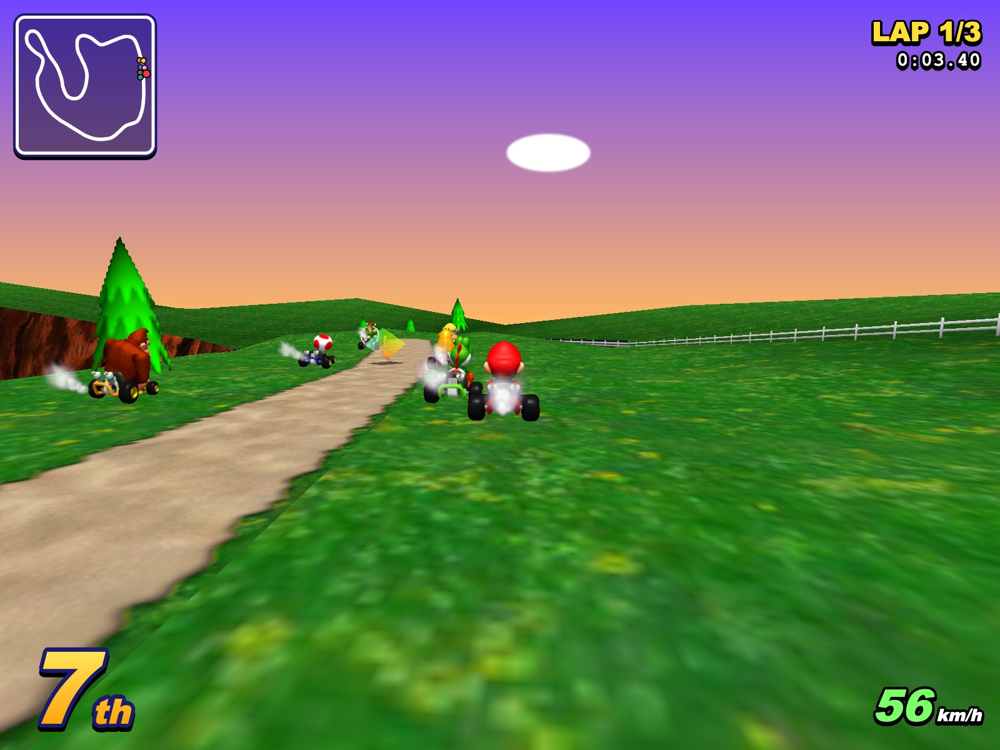
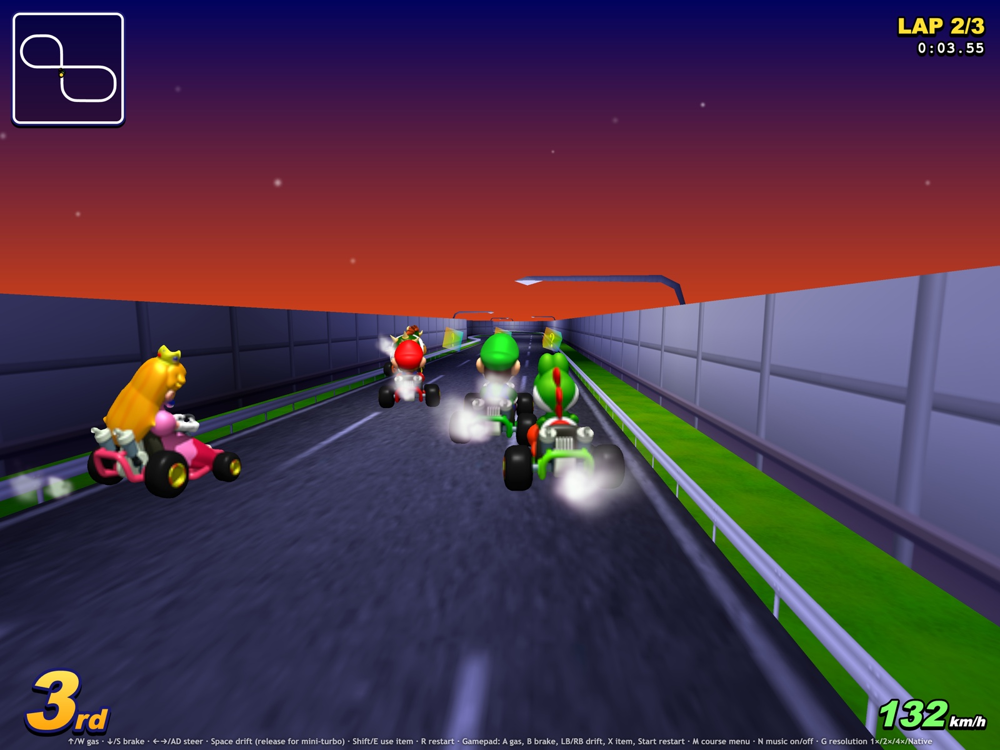

# MarioKart64JS

A browser clone of **Mario Kart 64** (built for testing purposes — to see how far AI/LLM tech can duplicate the game). Three.js + Vite, no emulator: the original N64 ROM's assets are extracted and re-used directly.

- Fan site + multiplayer lobby: https://mk64js.gokart.games (`website/`, a Cloudflare Worker: static assets plus the `/api/mp` lobby Durable Object — `cd website && npx wrangler deploy`)
- `npm install && npm run dev` → http://localhost:5173
- Title screen → GAME SELECT (1P / 2P / 3P / 4P GAME) → SELECT COURSE → PLAYER SELECT → race (Enter / click / arrows)
- 2P–4P GAME races **online, peer-to-peer, with the console's split screen** (see [Online play](#online-play))
- Controls: ↑/W gas · ↓/S brake · ←→/AD steer · Space drift (release for mini-turbo) · Shift/E use item · R restart · G resolution (1× 240p / 2× 480p / 4× 960p / Native) · N music · M course menu. Gamepad supported.

## Screenshots

Native resolution with the 4× HD textures (full 3200×2400 PNGs are attached to the [v0.0.1 pre-release](https://github.com/AgentiLoop/MarioKart64JS/releases/tag/v0.0.1)).

| | |
|---|---|
|  |  |
|  |  |
|  |  |
|  |  |
|  |  |
|  |  |
|  | |

## What's implemented

- **Game select** — the MAIN_MENU screen at its ROM positions (`tools/extract-mainmenu.py`): the 1P–4P GAME columns with their mode rows (Mario GP / Time Trials / VS / Battle), OPTION and DATA. 1P races the CPU as before; 2P–4P go online.
- **Online multiplayer** — 2–4 players peer-to-peer over WebRTC with the lobby on mk64js.gokart.games, and every game shows the split screen of the original (2P stacked, 3P/4P quadrants, the 3P map in the empty fourth).
- **Title screen** — ROM-extracted Mario Kart 64 logo, "©1996 Nintendo" copyright, flashing PUSH START button (blink at the native `(gGlobalTimer / 8) % 3` cadence) over the TKMK00-decoded blue-sky background.
- **Course select** — 16 native MK64 courses with ROM course-preview thumbnails on the sunset menu background.
- **Native courses** — all 16 MK64 tracks reconstructed from the ROM's course geometry + textures (MIO0/CI8/RGBA16 decoders in `tools/`).
- **Driving** — kart physics in the track Frenet frame; karts ride the native course surface and can't drive through walls. Karts go airborne off ramps and crests with the decomp's gravity and air drag, and the boost ramps (Royal Raceway, D.K.'s Jungle Parkway) launch long, floaty jumps.
- **Items** — item boxes give MK64 items (shell, banana, mushroom…).
- **Presentation** — N64-style 240-line upscaled render, or 2×/4×/Native with smooth mipmapped textures and optional HD texture tiers (G cycles, remembered), native skybox gradients, clouds/stars, kart exhaust smoke.
- **HUD** — position, lap, race timer, speedometer, minimap.
- **Sound** — the ROM's "Welcome to Mario Kart" voice on the title screen, and the ROM's own music: `src/m64.js` ports the decomp's sequence player (seqplayer.c / playback.c / effects.c), decodes the VADPCM instruments and plays the .m64 sequences in an AudioWorklet — title, menu and per-course race themes.

## Online play

Pick **2P, 3P or 4P GAME** on the game select screen, then a course and a driver as usual. The race page then waits on
the lobby: a room for that many players starts **15 seconds** after its first player arrives (or as soon as it is
full), and whoever picked the same player count in that time is in — no room codes, no names. Everyone races the
course the first player picked (your game reloads onto it if you chose another), each player drives their own driver
(a driver picked twice goes to the next free one), and the screen is the console's split screen with your view
carrying the full HUD. Enter while waiting races the CPU instead; Esc goes back to the menu.

- **mk64js.gokart.games only finds the players.** Its lobby (`website/src/lobby.js`, the same design as
  [GoKart](https://github.com/AgentiLoop/GoKart)'s) puts players in a room and relays the WebRTC handshake (offer /
  answer and ICE candidates over a WebSocket). After that it is out of the loop: the race runs over a **WebRTC full
  mesh** (`src/net.js`), every game talking directly to every other one.
- **Each game drives only its own kart** and sends its pose about 30 times a second; the other karts replay those
  poses 0.1 s in the past, so they move smoothly between packets. The lowest player id is the host and only decides
  the start: every game says READY once its mesh is up, the host answers GO and all of them run the 3-2-1 countdown.
- **Items:** you roll and use your own; every slick or seeker you drop appears in the other games, and only the player
  who gets hit decides that they were hit (their spin arrives in their pose). VS rules: no CPU karts online.
- **Connection:** the games find each other through public STUN servers (`ICE_SERVERS` in `src/net.js`); there is no
  TURN relay, so a player behind a very strict (symmetric) NAT may not connect. `?lobby=ws://localhost:8787/api/mp`
  on the game URL uses another lobby (`cd website && npx wrangler dev --port 8787`).

## Asset extraction

`tools/` contains Python scripts that pull assets straight from a Mario Kart 64 (USA) ROM:

- `extract-karts.py` — kart sprite atlases (8 drivers)
- `extract-faces.py` — character-select face animation frames (17 per driver)
- `extract-previews.py` — course preview thumbnails (16 race + 4 battle)
- `tkmk00.py` — TKMK00 decoder (menu backgrounds)
- `extract-item-boxes.py` — item box model, "?" card texture and per-course spawns
- `extract-smoke.py` — kart exhaust smoke puff frames (`src/smoke.js`)
- `extract-sounds.py` — "Welcome to Mario Kart" voice WAV plus the raw audio banks, sample tables, sequences and bank sets that `src/m64.js` plays
- `extract-mainmenu.py` — GAME SELECT banner, 1P–4P GAME cards, mode plates, OPTION / DATA and the cursor triangle

ROM SHA-1: `579c48e211ae952530ffc8738709f078d5dd215e`

### Graphics QC

`node tools/qc-graphics.mjs [--course mario] [--presets 1x,4x] [--shots /tmp/mk64-qc]` starts Vite and drives
every course in headless Chromium (needs `playwright-core`; set `PLAYWRIGHT_CORE` to its path if it is not
installed locally). It fails on failed requests, console errors, textures not loaded at the expected HD
tier, and z-fighting: each view is rendered as a flat per-batch ID buffer and again with sub-millimetre
camera jitter, and pixels inside a surface that change batch are counted as flicker.

### HD textures (optional)

`python3 tools/build-hd-textures.py /path/to/MK64-Reloaded-master` (needs Pillow) builds 2×/4×
versions of every matching image into `public/mk64-hd/` (git-ignored) from the
[MK64 Reloaded](https://github.com/GhostlyDark/MK64-Reloaded) pack. Course textures are matched by their
Rice/GLideN64 CRC, menus/faces/karts/sky by decomp name via the pack's SpaghettiKart port. The 2×/4×
presets use the matching tier (Native uses 2× below 720 lines, else 4×); kart atlases stop at 2× to keep
VRAM sane. Missing images fall back to the ROM originals.

## Roadmap

- Character select with animated faces (partial, missing highlighter)
- Battle mode (4 battle arenas)
- More gameplay parity (CC classes, AI personalities, Lakitu)

## References:

- lo-res graphics and sound in note form distilled from [n64decomp/mk64](https://github.com/n64decomp/mk64).
- hi-res graphics distilled from [GhostlyDark/MK64-Reloaded](https://github.com/GhostlyDark/MK64-Reloaded).

*This is a fan research project for AI-duplication testing. Mario Kart 64 is © Nintendo; assets belong to Nintendo and this repo is not affiliated with or endorsed by Nintendo.*
